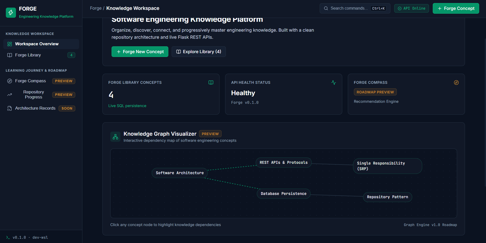
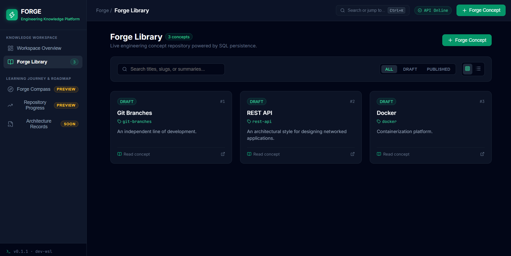
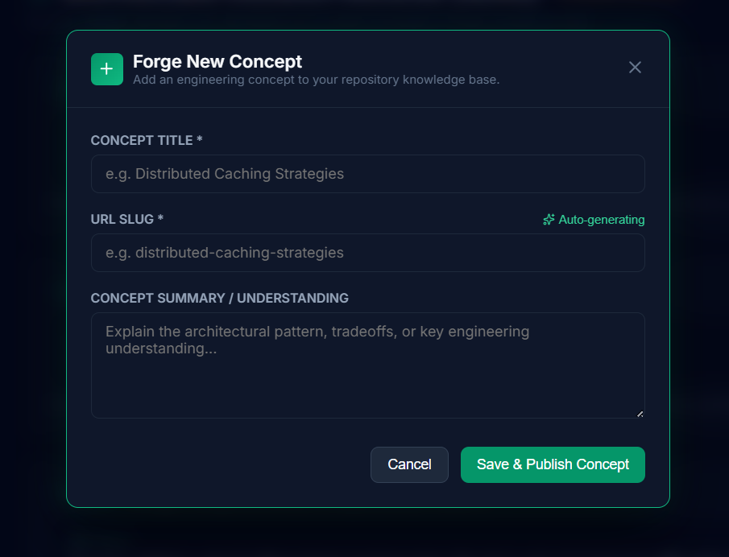
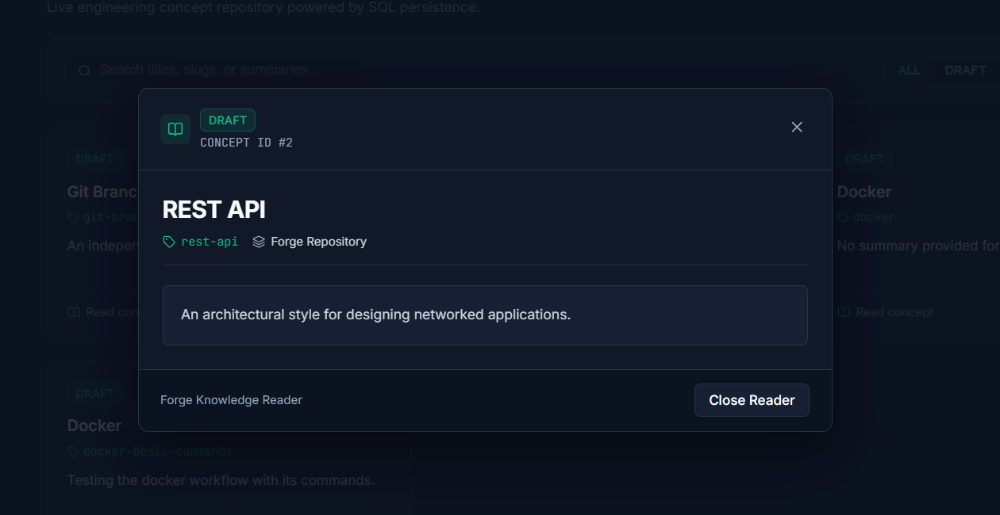
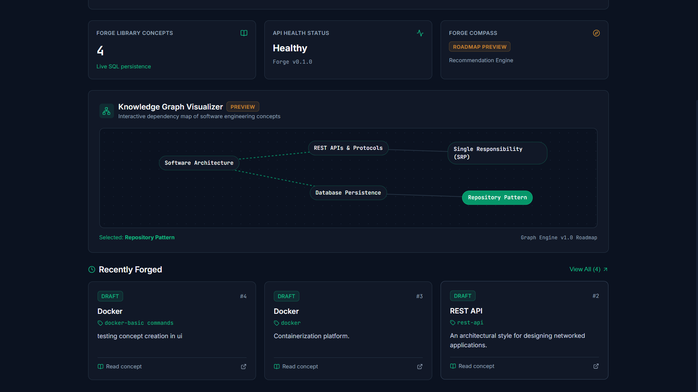
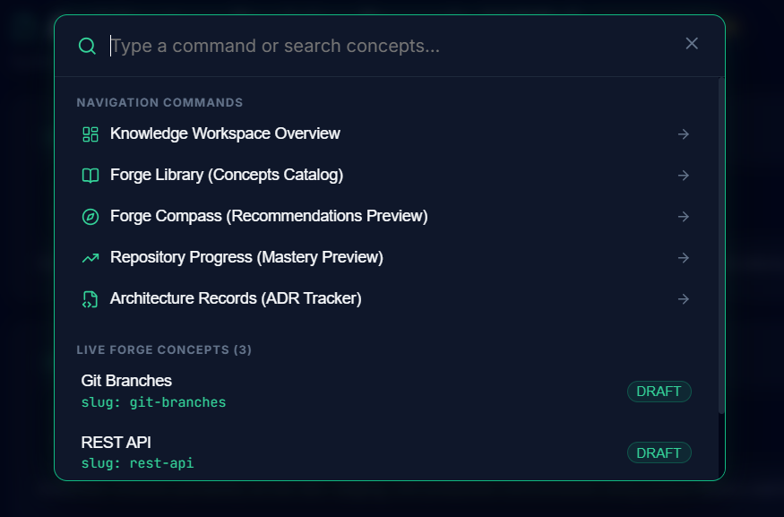
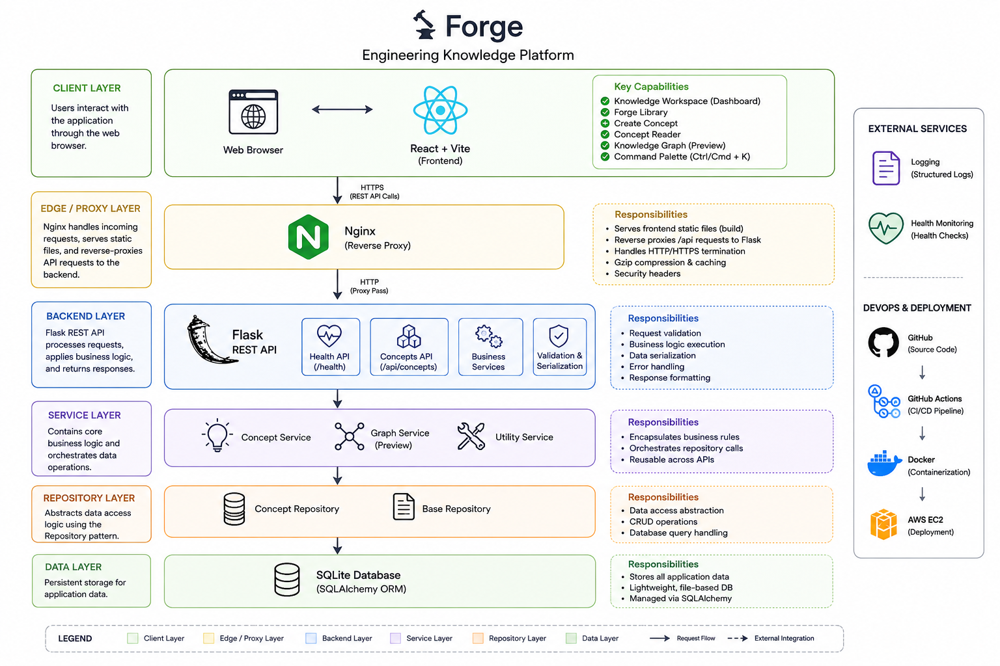
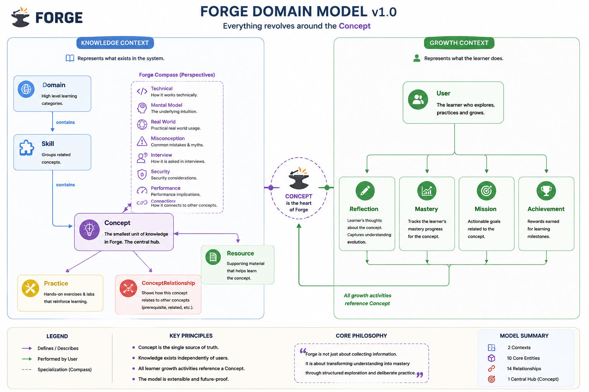
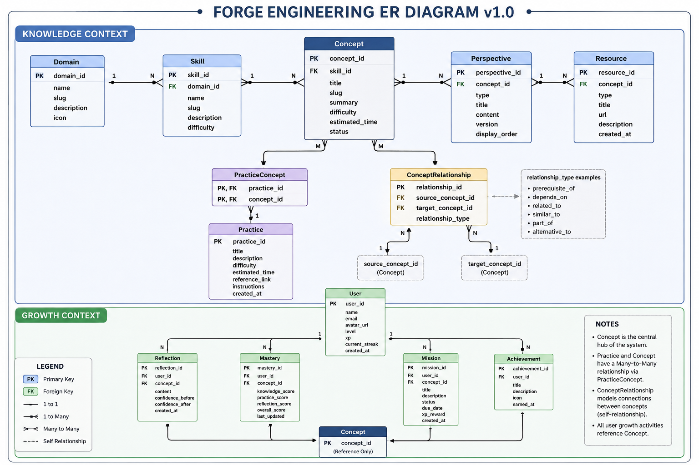

<div align="center">

# ⚒️ Forge

### Engineering Knowledge Platform

*A structured software engineering knowledge workspace built with React, Flask, Docker, and AWS.*


🔗 **Live Demo:** Deployed on AWS EC2 — currently offline to conserve credits. Screenshots below reflect the live application.

</div>

---

## 📖 Table of Contents

- Overview
- UI Preview
- Why Forge?
- Features
- Architecture
- Technology Stack
- Project Structure
- Running Locally
- Production Deployment
- Domain Model
- Entity Relationship Diagram
- Current Release
- Roadmap
- Design Philosophy
- Known Limitations
- License

# Overview

Forge is an engineering knowledge platform designed to organize software engineering concepts into a structured, searchable workspace.

Instead of storing isolated notes, Forge treats every **Concept** as the central unit of knowledge and builds relationships around it. The project focuses on clean architecture, modular backend design, and an extensible foundation for future learning features.

Version 1 establishes the core platform by delivering:

- Knowledge Workspace
- Concept Management
- Knowledge Library
- Interactive Knowledge Graph (Preview)
- REST API
- Dockerized Backend
- AWS EC2 Deployment
- GitHub Actions CI/CD

---

# 🖥️ UI Preview

<div align="center">

<a href="docs/screenshots/dashboard.png">

</a>

<a href="docs/screenshots/library.png">

</a>

<a href="docs/screenshots/create-concept.png">

</a>

<a href="docs/screenshots/reader.png">

</a>

<a href="docs/screenshots/graph.png">

</a>

<a href="docs/screenshots/command-palette.png">

</a>

</div>

<p align="center">
Click any screenshot to view it in full resolution.
</p>

---

# Why Forge?

Traditional note-taking tools store information.

Forge organizes engineering knowledge.

The long-term vision is to build an extensible platform capable of:

- structured learning
- concept relationships
- engineering roadmaps
- repository insights
- architectural documentation
- personalized learning progression

Every feature revolves around a single source of truth:

> **Concept**

---

# Features

## Knowledge Workspace

- Central dashboard
- Engineering-focused workspace
- API health monitoring
- Concept statistics
- Responsive layout

---

## Forge Library

- Browse engineering concepts
- Search concepts
- Grid/List views
- Read concept summaries
- Live REST API integration

---

## Create Concept

- Modal-based creation workflow
- Loading states
- Success & error notifications
- Automatic library refresh
- Form validation

---

## Knowledge Graph (Preview)

Interactive visualization showing relationships between engineering concepts.

Current version includes:

- Concept nodes
- Relationship visualization
- Interactive highlighting
- Future-ready architecture

---

## Command Palette

Keyboard-first navigation.

Supports:

- Ctrl + K (Windows/Linux)
- Cmd + K (macOS)

Features:

- Search navigation
- Search concepts
- Keyboard navigation
- Escape to close

---

## Backend

REST API built using Flask.

> **Note:** In local development (running Flask directly via `python -m app.app`), the API is available at `http://localhost:5000`. In production, the backend runs inside a Docker container with Nginx reverse-proxying requests on port `80`, so the API is available at `http://localhost` (no port) or your domain.

### Endpoints

| Method | Endpoint | Description |
|--------|----------|--------------|
| GET | `/health` | API health check |
| GET | `/api/concepts/` | List all concepts |
| GET | `/api/concepts/<slug>` | Get a single concept by slug |
| POST | `/api/concepts/` | Create a new concept |

### Example: Health check

**Request**
```bash
curl http://localhost/health
```

**Response** `200 OK`
```json
{
  "application": "Forge",
  "environment": "development",
  "status": "healthy",
  "version": "0.1.1"
}
```

### Example: List concepts

**Request**
```bash
curl http://localhost/api/concepts/
```

**Response** `200 OK`
```json
[
  {
    "id": 1,
    "slug": "git-branches",
    "status": "DRAFT",
    "summary": "An independent line of development",
    "title": "Git Branches"
  },
  {
    "id": 2,
    "slug": "rest-api",
    "status": "DRAFT",
    "summary": "An architectural style for designing networked applications.",
    "title": "REST API"
  }
]
```

---

## DevOps

- Dockerized backend
- Nginx reverse proxy
- AWS EC2 deployment
- GitHub Actions CI/CD pipeline

---

# 🏗️ System Architecture

Forge follows a layered architecture that separates presentation, business logic, data access, and infrastructure responsibilities. This modular design keeps the application maintainable, extensible, and production-ready.

<div align="center">

<a href="docs/architecture-diagram.png">
    
</a>

<br>

<sub><b>Figure:</b> High-level architecture of Forge v1.0</sub>

</div>

### Architecture Highlights

- **Client Layer** – React + Vite single-page application.
- **Edge Layer** – Nginx serves the frontend and reverse proxies API requests.
- **Backend Layer** – Flask REST API exposes application endpoints.
- **Service Layer** – Business logic is encapsulated into reusable services.
- **Repository Layer** – Repository pattern abstracts database operations.
- **Data Layer** – SQLite managed through SQLAlchemy ORM.
- **Infrastructure** – Docker, GitHub Actions, and AWS EC2 provide deployment and CI/CD.

---

# Technology Stack

| Layer | Technology |
|---------|------------|
| Frontend | React + Vite |
| Styling | CSS |
| Backend | Flask |
| ORM | SQLAlchemy |
| Database | SQLite |
| API | REST |
| Containerization | Docker |
| Reverse Proxy | Nginx |
| CI/CD | GitHub Actions |
| Hosting | AWS EC2 |
| Version Control | Git + GitHub |

---

# Project Structure

```
forge/
│
├── backend/
│   ├── app/
│   │   ├── api/
│   │   ├── config/
│   │   ├── database/
│   │   ├── models/
│   │   ├── repositories/
│   │   ├── services/
│   │   └── app.py
│   │
│   ├── Dockerfile
│   └── requirements.txt
│
├── frontend/
│   ├── public/
│   ├── src/
│   │   ├── assets/
│   │   ├── components/
│   │   ├── pages/
│   │   ├── services/
│   │   ├── App.jsx
│   │   └── main.jsx
│   │
│   ├── package.json
│   └── vite.config.js
│
├── infrastructure/
├── scripts/
├── docs/
├── postman/
└── .github/
```

---

# Running Locally

## Clone

```bash
git clone <repository-url>
cd forge
```

---

## Backend

```bash
cd backend

python -m venv .venv

source .venv/bin/activate

pip install -r requirements.txt

python -m app.database.init_db

python -m app.app
```

Backend runs on

```
http://localhost:5000
```

---

## Frontend

```bash
cd frontend

npm install

npm run dev
```

Frontend runs on

```
http://localhost:3001
```

---

# Production Deployment

Forge v1 uses:

- Docker
- Nginx
- AWS EC2
- GitHub Actions (CI/CD)

**Deployment flow:**

```
GitHub
   ↓
GitHub Actions (build + test)
   ↓
AWS EC2 (must be running)
   ↓
Docker Build
   ↓
Container Restart
   ↓
Nginx Reload
```

> **Note:** The EC2 instance is manually started and stopped to conserve AWS credits. The GitHub Actions pipeline requires the instance to be running to complete the build and deployment — if the instance is stopped, the workflow builds and tests but cannot finish deploying to the instance. Full automation (auto-start instance → deploy → auto-stop, triggered by a single command) is planned for a future iteration.

---

# Domain Model

Everything in Forge revolves around the **Concept** — the central hub connecting the Knowledge Context (what exists in the system) and the Growth Context (what the learner does).

<div align="center">

<a href="docs/domain-model.png">

</a>

</div>

### Key Principles

- Concept is the single source of truth.
- Knowledge exists independently of users.
- Every learner activity references a Concept.
- The model is extensible and future-proof.

---

# Entity Relationship Diagram

<div align="center">

<a href="docs/er-diagram.png">

</a>

</div>

### Model Summary

- **2 Contexts**
- **10 Core Entities**
- **14 Relationships**
- **1 Central Hub (Concept)**

The data model is divided into:

### Knowledge Context

- Domain
- Skill
- Concept
- Perspective
- Resource
- Practice
- ConceptRelationship

### Growth Context

- User
- Reflection
- Mastery
- Mission
- Achievement

All growth-related entities ultimately reference a **Concept**, making it the single source of truth across the platform.

---

# Current Release

## Forge v1.0

### ✅ Implemented

- Knowledge Workspace
- Forge Library
- Create Concept
- Concept Reader
- Command Palette (Ctrl/Cmd + K)
- Interactive Knowledge Graph (Preview)
- REST API
- Dockerized Flask Backend
- GitHub Actions CI/CD
- AWS EC2 Deployment
- Nginx Reverse Proxy
- Responsive Dashboard

### Preview Modules

- Forge Compass
- Repository Progress
- Architecture Records

---

# Roadmap

| Version | Status | Planned Features |
|----------|:------:|------------------|
| **v1.0** | completed | Knowledge Workspace, Concept CRUD, Docker, EC2 Deployment |
| **v1.5** | work in progress | Repository Analytics, Graph Improvements, Learning Roadmaps, Fully Automated Deployment |
| **v2.0** | queue | Authentication, User Profiles, Progress Tracking |
| **v3.0** | planned | AI Recommendations, Repository Intelligence, Interview Preparation |

---

# Design Philosophy

Forge follows several engineering principles:

- Concept-first architecture
- Separation of concerns
- Repository pattern
- RESTful API design
- Modular frontend components
- Production-oriented deployment
- Extensible domain model
- Clean engineering over visual complexity

---

# Known Limitations (v1)

- SQLite database
- No authentication
- Preview modules are placeholders
- Knowledge Graph is static
- No relationship editor
- Limited concept metadata
- Deployment pipeline requires the EC2 instance to be manually running to complete

These are planned improvements for future releases.

---

## Project Status

Forge **v1.0** establishes the core foundation of the platform by delivering a complete concept management workflow, a modular backend architecture, containerized deployment, and cloud hosting.

Future releases will expand Forge into a comprehensive engineering learning ecosystem with personalized growth tracking, repository intelligence, and AI-assisted knowledge discovery.

---

# Author

**Afsal Ali**

B.Tech Information Technology

B. S. Abdur Rahman Crescent Institute of Science and Technology

---

# License

This project is licensed under the MIT License.